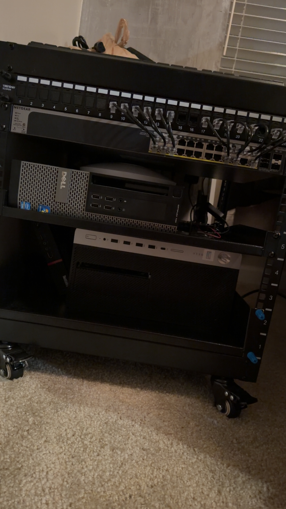
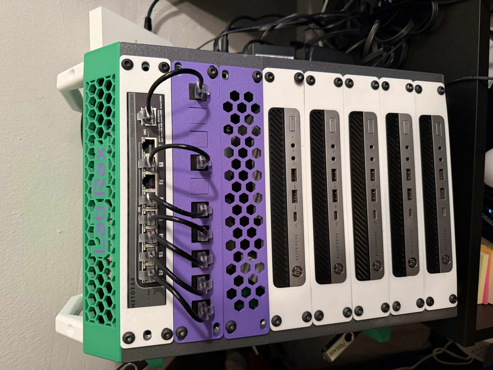

# homelab-infra
This is my repo to document all major steps in my homelab as I progress. This will act as my refrence point, to keep track of my journey. Follow along if you would like!

## Goals
- Apply the theory I learn in class, hands-on
- Gain practice in environments that replicate true production clusters

## Current Setup

### Three-node Proxmox Cluster

- 19" networking rack
- 24 port rack mounted Netgear switch, PoE+ & SFP+ ports

| Machine | Memory | CPU | GPU | Storage |
|---------|--------|-----|-----|---------|
| HP Prodesk tower | 48GB DDR4 | Intel Core i5-8500 | 4GB MSI GeForce GTX 1650 | 1TB SSD, 1TB HDD |
| Dell Optiplex 790 (SFF) | 32GB DDR3 | Intel Core i5-24400 | xxxx | 512GB SSD |
| ThinkCentre thin-client | 8GB DDR3 | Intel Core i3-6100T | xxxx | 500GB HDD |

### Five-node Kubernetes Cluster

#### x5

| Machine | Memory | CPU | Storage |
|---------|--------|-----|---------|
| HP Elitedesk G4 800 Mini | 8GB DDR4 | Intel Core i5-7500T | 500GB SSD |

## Architecture (Current Direction)
- three-node proxmox cluster (sandbox and testing env)
- five-node Kubernetes Cluster (practice high-availability & other enterprise tactics)
- netgear 24-port rack mounted switch (PoE+ & SFP ports)
- OPNSense deny-all firewall

## Why This Project Exists
Rather than isolated tutorials, this home lab is being built intentionally, with a focus on *why* each service/segment exists. Understanding how each piece interacts with each other is like putting together each piece of the puzzle... a puzzle that can create a well-developed production level system.

## Status
- Rebuilding doucmentation repo
- Deploying a five-node Kubernetes cluster
